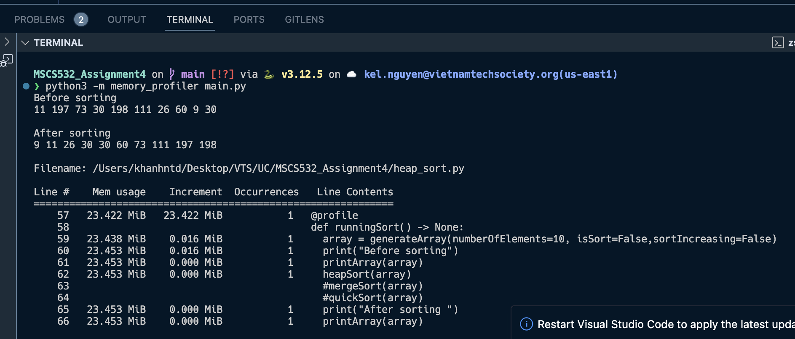
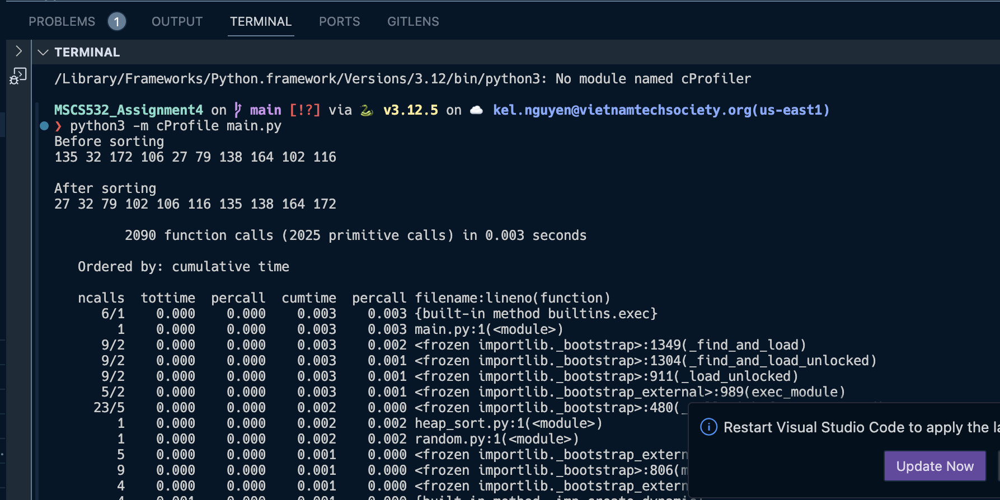
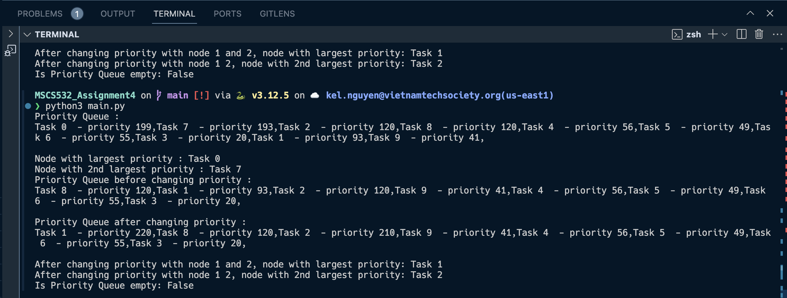
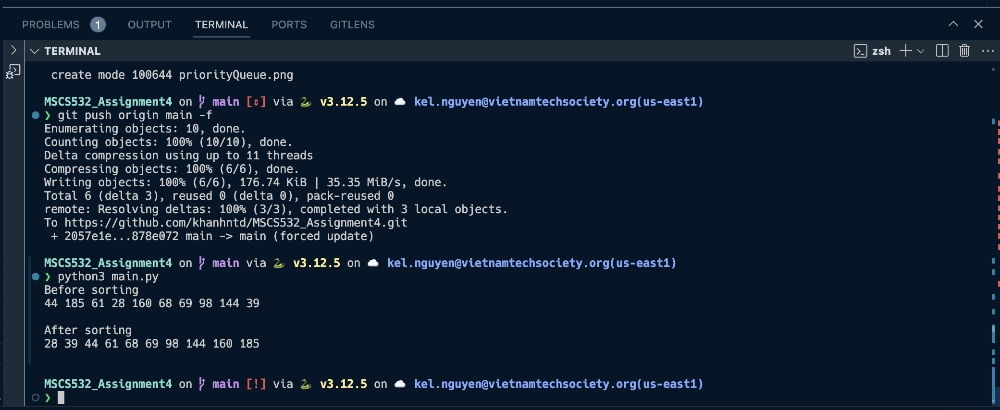

# MSCS532_Assignment4

## Setup
- **Step 1:** Download python https://www.python.org/downloads/
- **Step 2:** Download python extension from vsc https://code.visualstudio.com/
- **Step 3:** Download pip https://www.geeksforgeeks.org/how-to-install-pip-in-macos/
```
curl https://bootstrap.pypa.io/get-pip.py -o get-pip.py
python3 get-pip.py
```
- **Step 4:** Download memory profile (since cProfile is part of Python's in-house dependency )
```
pip install -U memory_profiler
```

## Output
To run the sorting with corresponding profiler, we need to execute the the following commands:
```
python3 main.py
```
### Profiler
To run the sorting with corresponding profiler, we need to execute the the following commands:
- **Memory profiler:**
```
python3 -m memory_profiler main.py
```


- **CPU Profiler:**
```
python3 -m cProfile main.py
```


### Algorithm
- **Priority Queue:** is a type of queue that arranges elements based on their priority values and performs
well when using max heap as an internal data structures with array (array peform betters than linked list if we need
random accesss memory or when knowing the array's fix size before hand)



- **Heap Sort:** performs sorting with the same average complexity O(n log n) for all cases and better than Quick Sort for sorted cases.


